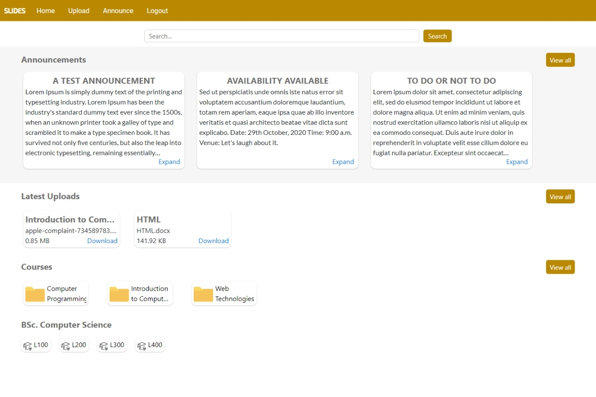
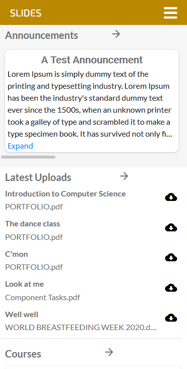

# Slides overview 

The application allows users - students - to upload course materials and make announcements which are then stored in a database that can only be seen by users in the same university and in some cases, only users who are reading the same program as the uploader in the same university.

## Registration
All users are supposed to open an account (register) before they can upload or access anything. During registration, users are asked to select their university, school (department), program and level from a list added to the database by a site administrator.

## Homepage
After registration, users are logged in and redirected to the homepage where they have access to up to five recent announcements for students in the user's university, five recently uploaded documents specific to the user's level and course, courses specific to the user's level and program, and levels. The user can view more annoucements, uploaded documents or courses by clicking or tapping on the view all button adjacent to each category.

Users can make announcements or uploads files, one at a time, by clicking on the relevant navigation links on the navigation bar.

# Why the restrictions?
While the restrictions make sure that users are not overwhelmed by too many documents and announcements that are not relevant to them, the restrictions also make sure that some documents that some lecturers - or in some cases owners who are not necessarily lecturers - might not want distributed outside their university do not get distributed outside the university.

# Files

## Back end

### [slides/models.py](slides/models.py "models.py")
This file contains all the program's models

### [slides/urls.py](slides/urls.py "urls.py")
This file contains all the web application's urls

### [slides/views.py](slides/views.py "views.py")
This file contains all the program's views.

### [slides/templatetags/custom_template_tags.py](slides/templatetags/custom_template_tags.py "custom_template_tags.py")
This contains custom template tags for the web application.

## Front end

## _Templates_

### [slides/templates/slides/announce.html](slides/templates/slides/announce.html)
This is the page where the user can compose new announcements.

### [slides/templates/slides/announcement.html](slides/templates/slides/announcement.html)
The user is directed to this page when s/he expands an announcement

### [slides/templates/slides/announcements.html](slides/templates/slides/announcements.html)
This page is where the user views all announcements

### [slides/templates/slides/course.html](slides/templates/slides/course.html)
Shows all uploaded documents for a particular course.

### [slides/templates/slides/documents.html](slides/templates/slides/documents.html)
Displays all uploaded documents relevant to the user

### [slides/templates/slides/index.html](slides/templates/slides/index.html)
This is the homepage of the web application

### [slides/templates/slides/layout.html](slides/templates/slides/layout.html)
General layout of the web application's UI. It has the navbar, most scripts, general page and the footer. This is extended by other html files.

### [slides/templates/slides/login.html](slides/templates/slides/login.html)
This is the user login page.

### [slides/templates/slides/program.html](slides/templates/slides/program.html)
Shows all available courses of a particular program. This is diplayed based on the level clicked on by the user on the homepage.

### [slides/templates/slides/register.html](slides/templates/slides/register.html)
User registration page.

### [slides/templates/slides/search.html](slides/templates/slides/search.html)
Displays search results.

### [slides/templates/slides/upload.html](slides/templates/slides/upload.html)
This is where the user can upload files.

## _Static files_ - Javascript

### [slides/static/slides/register.js](slides/static/slides/register.js)
This works on the user registration page. It sends the user's selections to the back end and receives relevant data that the user uses in registering - When the user chooses a university, that data is sent to the back end and available schools in the chosen university are sent back to the user to choose. This also happens when a school is chosen where the programs in that school are received by the user and levels after a program is chosen.

## _Static files_ - _SASS(SCSS)/CSS_
The files here - aside styles.scss, styles.css, styles.css.map, styles-mobile.scss, styles-mobile.css and styles-mobile.css.map - are the 'design' files of their named html file.

Example: announce.scss is the 'design' file for announce.html which is compiled to announce.css using announce.css.map.

### [slides/static/slides/styles.scss](slides/static/slides/styles.scss)
This is the sass file for the general UI of the web application. This contains the design of the navigation bar, the homepage, the footer and other aspects of the web application is desktop mode. This is compiled to styles.css for use by the browser.

### [slides/static/slides/styles-mobile.scss](slides/static/slides/styles-mobile.scss)
This works just like the **styles.scss** but in mobile mode using media query. This is also compiled to styles-mobile.css for use by the browser.

## Others

### document
This is where all unploaded files are stored.

# Demo
You can watch the video of the project on YouTube here: https://youtu.be/GjEVA7XinyU